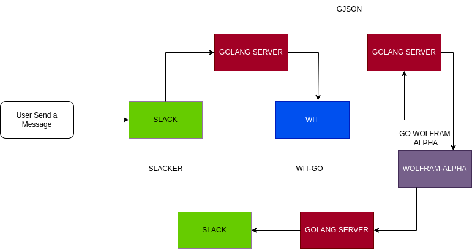

# AI Bot in GO

A simple chatbot using Go, WIT-AI, WOLFRAM-ALPHA and SLACK API.

## Installing the packages

* ```go
    go get github.com/shomali11/slacker
    ```

* ```go
    go get github.com/joho/godotenv
    ```

* ```go
    go get github.com/krognol/go-wolfram
    ```

* ```go
    go get github.com/tidwall/gjson
    ```

* ```go
    go get github.com/wit-ai/wit-go/v2
    ```

## Setting Up ENV file

Kindly Put the Following fields in your ```.env``` file.

1) SLACK_BOT_TOKEN
2) SLACK_APP_TOKEN
3) WIT_AI_TOKEN
4) WOLFRAM_APP_ID

## Working

Watch this [Demo video](https://youtu.be/xTlvS7EfSAQ) for better understanding :)

* Flowchart Diagram

     
